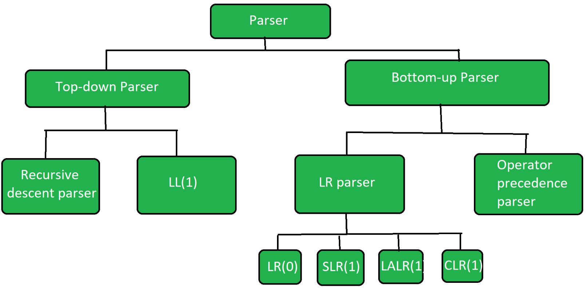

# C_Compiler

## Description
This is a simple C compiler written in c++. It is able to compile a subset of the C language. The compiler is able to compile the following:
- Variable declarations
- Function declarations
- Function calls
- Arithmetic expressions
- If statements
- While loops
- Return statements
- Comments
- Print statements

## Usage

## Scanner implementation details


## Parser Grammar
```program            -> declaration_list

declaration_list   -> declaration declaration_list
                    | declaration

declaration        -> variable_declaration
                    | function_declaration

variable_declaration -> data_type identifier_list ;

identifier_list    -> identifier , identifier_list
                    | identifier

data_type          -> int
                    | double
                    | string
                    | float

function_declaration -> data_type identifier ( parameter_list ) compound_statement

parameter_list     -> parameter , parameter_list
                    | parameter

parameter          -> data_type identifier

compound_statement -> { statement_list }

statement_list     -> statement statement_list
                    | statement

statement          -> expression_statement
                    | if_statement
                    | while_statement
                    | for_statement
                    | return_statement
                    | declaration

expression_statement -> expression ;

if_statement       -> if ( expression ) statement
                    | if ( expression ) statement else statement

while_statement   -> while ( expression ) statement

for_statement     -> for ( expression_statement ; expression ; expression_statement ) statement

return_statement  -> return expression ;

expression         -> assignment_expression

assignment_expression -> logical_or_expression
                        | logical_or_expression = assignment_expression

logical_or_expression -> logical_and_expression
                        | logical_or_expression || logical_and_expression

logical_and_expression -> equality_expression
                         | logical_and_expression && equality_expression

equality_expression -> relational_expression
                      | equality_expression == relational_expression
                      | equality_expression != relational_expression

relational_expression -> additive_expression
                         | relational_expression < additive_expression
                         | relational_expression > additive_expression
                         | relational_expression <= additive_expression
                         | relational_expression >= additive_expression

additive_expression -> multiplicative_expression
                       | additive_expression + multiplicative_expression
                       | additive_expression - multiplicative_expression

multiplicative_expression -> primary_expression
                             | multiplicative_expression * primary_expression
                             | multiplicative_expression / primary_expression
                             | multiplicative_expression % primary_expression

primary_expression -> identifier
                     | literal
                     | ( expression )
                     | function_call

function_call      -> identifier ( argument_list )

argument_list      -> expression , argument_list
                     | expression

identifier         -> [a-zA-Z_][a-zA-Z0-9]*
literal            -> number | string

number             -> [0-9]+(\.[0-9]+)?([eE][-+]?[0-9]+)?
string             -> "([^"\\]*(\\.)*[^"\\]*)*"

```

## Parser implementation details


The parser is implemented using a recursive descent parser. The parser is implemented in the `parser.cpp` file. The parser is able to parse the grammar defined above. The parser is able to parse the following constructs:
- Variable declarations
- Function declarations
- Function calls
- Arithmetic expressions
- If statements
- While loops
- For loops
- Return statements
- Comments
- Print statements


# Gui implementation details
